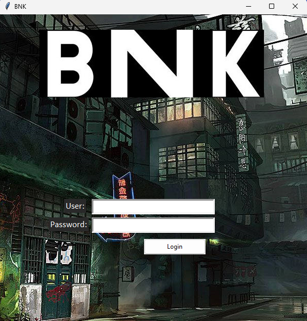
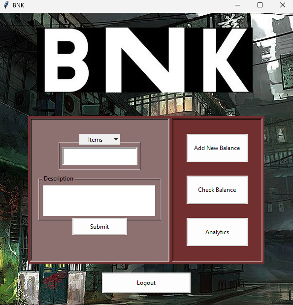
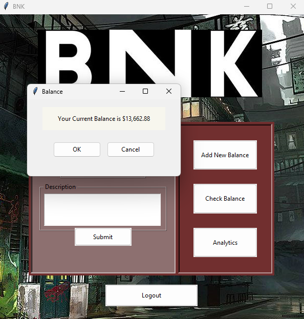
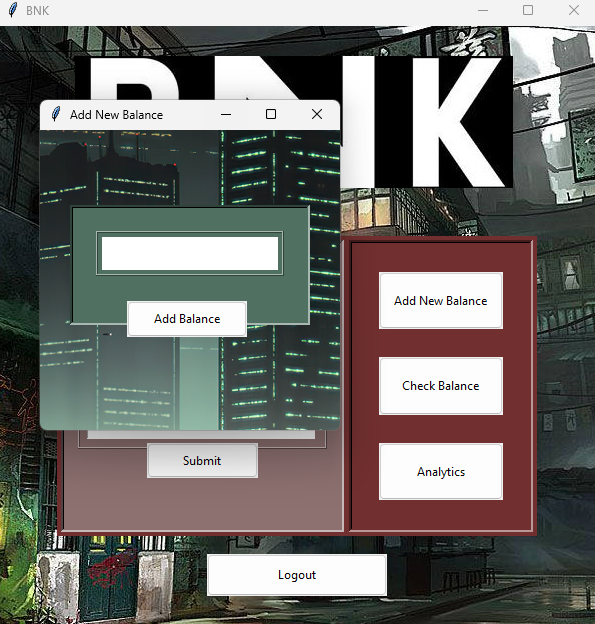
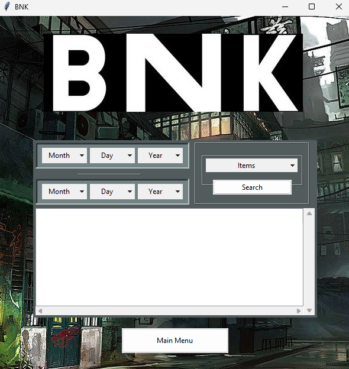

# BNK
Finance framework tool to help save money

### Features:
- GUI display
- Data stored in local database file
- Analytics
- Check and update balance

### Installation:
```bash:
git clone https://github.com/adylon/bnk.git
cd bnk
python bnk.py
```

### Usage:
- First, you'll be brought to the login screen. Log in with username and password:



- Main menu has entries to provide your spending amount and option box for type of item that was purchased, submit when finished
- Main menu has three tabs: add new balance, check balance, and analytics



##### - Check Balance:
- Checks for you curent balance



##### - Add New Balance:
- Entry for updating balance



##### - Analytics:
- This page is for querying transactions based on specific time period and type of item that was spent



